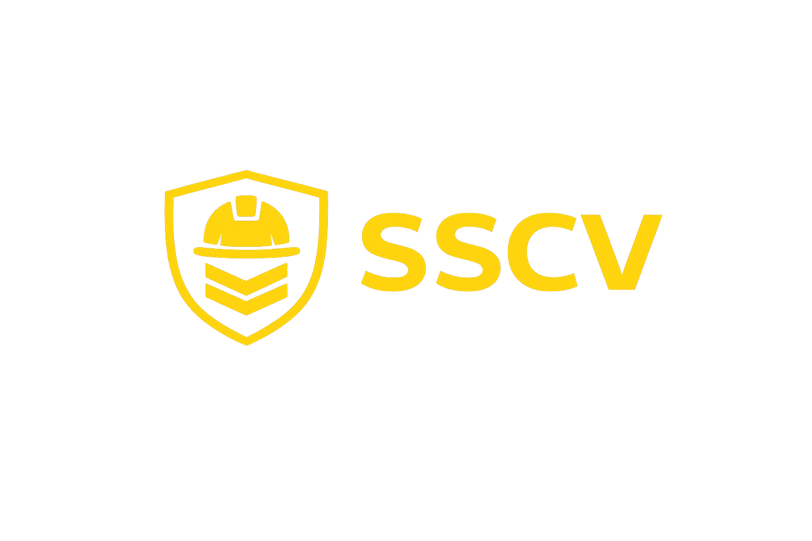
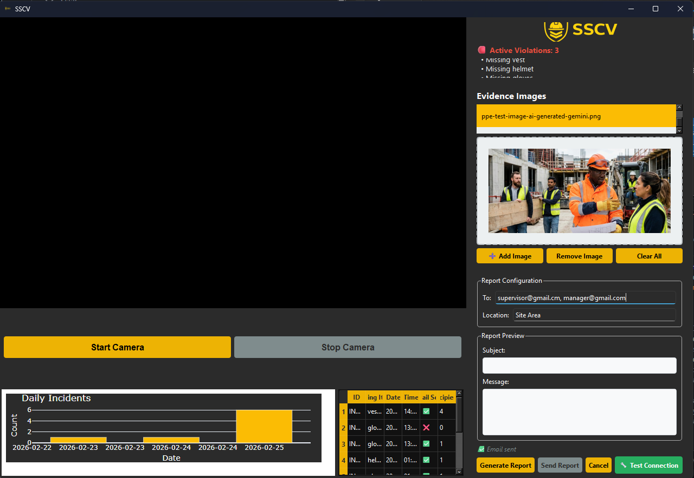

# SafeShieldCV (SSCV) 🛡️👷‍♂️
Real-time AI-Powered PPE Detection & Reporting System

### 🏢 Developed by Team-TASK (Tchana, Aloknath, Subhadra, Krishna)
Providing AI-automated digital solutions. We offer a full pipeline: Consultation, Implementation, Deployment, and Services.

### Logo

### 📝 Project Overview
SafeShieldCV is a proactive industrial safety solution designed to automate PPE (Personal Protective Equipment) monitoring. Utilizing Computer Vision and Large Language Models (LLMs), the system identifies safety violations in real-time, documents evidence, and automates the reporting workflow for supervisors.

In high-risk environments, human oversight is often inconsistent. SafeShieldCV provides 24/7 vigilance, ensuring that helmet, vest, and glove violations are caught and reported instantly to maintain a zero-incident culture.

### UI Dashboard

### 🎯 Target Audience
- Construction Site Managers
- Warehouse Safety Officers
- Manufacturing Compliance Teams

### How to use SSCV?

Please go visite [SSCV Wiki page](https://github.com/Rackkoun/safeshieldcv/wiki)